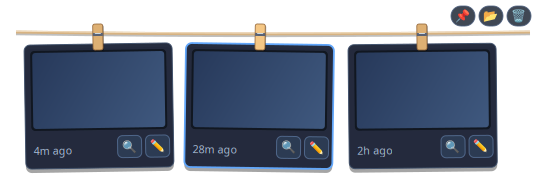

# 🧺 Clothesline

<p align="center">
  <strong>Screenshots, hung out to dry.</strong><br>
  <em>A minimalist desktop overlay for Linux (Wayland & X11) and Windows that hangs your screenshots on a line at the top of your screen.</em>
</p>

<p align="center">
  
  
  
  
</p>

---

<p align="center">
  
</p>

Inspired by Alejandro Buján's native macOS app [Tendedero](https://github.com/alejandrobujan/tendedero), **Clothesline** brings the same physical, tactile delight to Linux (GNOME, KDE, Wayland, X11) and Windows. 

Whenever you capture a screenshot, it automatically hangs from a braided clothesline at the top of your display with a wooden clothespin. Out of sight, but right within reach when you need it.

---

<p align="center">
  <em>When collapsed, only a fine, delicate cord floats at the top edge of your screen:</em><br>
  
</p>

---

## ✨ Features

- 🪄 **True 100% Per-Pixel Transparency:** Native GTK3 + Cairo 32-bit ARGB visual rendering. Zero black background boxes, zero borders, and zero intrusive containers. Only the cord, clothespins, and cards are drawn over your wallpaper.
- 🧵 **Delicate Idle State:** Collapses to a fine 22px braided hemp line along the top edge of the screen.
- 🪵 **Realistic Wooden Clothespins:** Clamps each screenshot card. Click the pin (or drag the card downwards) to unclip it: the pin springs off, the card swings from one corner and falls away.
- 🕊️ **Screenshots Fly In:** A new screenshot swoops up onto the line and its clothespin snaps on with a little twang.
- 🪢 **A Rope That Feels Real:** The line sags under each card and wobbles when one arrives or leaves.
- 🍃 **Gusts of Wind:** Every so often a breeze sways the cards (hovering a card holds it still). Turn it off with `--no-wind` or from the right-click menu.
- 🧺 **Clear All, One by One:** The 🗑️ button drops every card off the line in a little cascade.
- 📋 **One-Click Clipboard Copy:** Click anywhere on a photo thumbnail to instantly copy the image to your system clipboard (`wl-copy`, `xclip`, or native Windows/macOS API) with a green `✓ Copied!` badge.
- 🔍 **Instant Full-Size Quick Look:** Click the **`🔍`** button to view the screenshot in large format without opening heavy apps. Supports keyboard shortcuts (`Esc` / `Space` / `q` to close, `e` to edit, `c` to copy).
- ✏️ **Built-in Markup & Crop Editor:** Click the **`✏️`** button or double-click any card to draw annotations (freehand pen, circles, rectangles), crop, undo/redo, and choose colors. Edits save in-place directly to the screenshot file and update the line in real time!
- ↔️ **Draggable Top Bar:** Click and drag the clothesline horizontally to position it anywhere along your screen's top bezel (safely clear of the GNOME clock or system indicators).
- 🧈 **Smooth Pull-Down Animation:** Lowering the cord from the top of the screen runs at 60 FPS with cubic ease-out motion.
- 🪟 **100% Flicker-Free:** Uses passive event listeners (`<Enter>`, `<Leave>`, `<Motion>`) and silent filesystem checks (`os.scandir`). Zero active pointer polling or clipboard pinging—focused windows like VS Code will never flicker or drop focus.

---

## 🕹️ Gestures & Controls

| Action | Control / Gesture | Description |
|---|---|---|
| **Copy Image** | **Click thumbnail** | Copies full resolution screenshot to clipboard with `✓ Copied!` feedback |
| **Drop / Close** | **Click clothespin** | Unclips the wooden pin and drops the screenshot from the clothesline |
| **Drop / Close** | **Drag card down** | Pull downwards (`dy > 45px`) to unclip and remove |
| **Quick Look** | **`🔍` button** | Opens full-size dark preview window (`Esc` or `Space` to dismiss) |
| **Markup & Crop** | **`✏️` button** or **Double-click** | Opens the built-in annotation editor |
| **Context Menu** | **Right-click card** | Menu with Copy, View, Edit, Reveal in Folder, and Drop |
| **Line Menu** | **Right-click the rope** | Keep open, wind on/off, open folder, clear all, and **Quit** |
| **Move Clothesline**| **Click & drag cord** | Reposition horizontally across the top panel |
| **Expand Line** | **Hover / Click cord** | Glides the line and hanging screenshots down smoothly |
| **Collapse Line** | **Move mouse away** | Automatically tucks back up after 2 seconds (if unpinned) |
| **Keep Open** | **`📌` Pin button** | Toggles permanent pinned mode (prevents auto-hiding) |
| **Clear All** | **`🗑️` Clear button** | Unclips all screenshots from the line at once |
| **Open Folder** | **`📂` Folder button** | Opens your system screenshot directory in the file manager |
| **Scroll History** | **Mouse wheel** / **`◀` `▶`** | Slide horizontally through screenshot history |

---

## 🚀 Getting Started

### Linux (Ubuntu, Debian, Fedora, Arch)

1. **Install dependencies:**
   
   **Ubuntu / Debian:**
   ```bash
   sudo apt install python3-gi python3-cairo python3-pil python3-tk wl-clipboard
   ```

   **Fedora:**
   ```bash
   sudo dnf install python3-gobject python3-cairo python3-pillow python3-tkinter wl-clipboard
   ```

   **Arch Linux:**
   ```bash
   sudo pacman -S python-gobject python-cairo python-pillow tk wl-clipboard
   ```

2. **Option A: Install permanently via APT (.deb package - Recommended)**
   ```bash
   # Build or download the .deb package:
   ./build-deb.sh

   # Install with APT (handles all dependencies and sets up autostart automatically):
   sudo apt install ./clothesline_1.0.0_all.deb
   ```
   *Clothesline will now start automatically whenever you log into your desktop and appear in your application launcher with an app icon.*

3. **Option B: One-Command Installer (Without root):**
   ```bash
   ./install.sh
   ```
   *Installs to `~/.local/bin/clothesline`, registers the desktop launcher, and adds to `~/.config/autostart`.*

4. **Option C: Run Directly (Portable):**
   ```bash
   python3 clothesline.py
   ```

To uninstall:
```bash
sudo apt remove clothesline   # If installed via APT
# or:
./uninstall.sh                # If installed via install.sh
```

---

### Windows

**Option A: Download the app (no Python needed)**

Download `Clothesline.exe` from the [Releases page](https://github.com/1Hackoon/clothesline-app/releases) and double-click it. Windows SmartScreen may warn about an unknown publisher the first time, because the app is not code-signed: click **More info → Run anyway**.

To start it automatically, press `Win + R`, type `shell:startup`, and put a shortcut to `Clothesline.exe` in that folder.

**Option B: Run from source**

1. Install [Python 3.10+](https://www.python.org/) (ensure **"Add python.exe to PATH"** is checked).
2. Install Pillow and pycairo:
   ```cmd
   pip install pillow pycairo
   ```
3. Run:
   ```cmd
   pythonw clothesline.py
   ```

Clothesline watches your Windows *Screenshots* folder (`Win + PrtScn`, or the Snipping Tool with auto-save on), including when OneDrive moves it.

*On Windows the overlay uses a colour-key window, so soft shadows are left out and edges are a little crisper than on Linux.*

---

## ⚙️ Command Line Options

```text
usage: clothesline.py [-h] [--folder FOLDER] [--count COUNT] [--pinned] [--no-wind] [--backend {auto,gtk,tk}]

options:
  -h, --help       show this help message and exit
  --folder FOLDER  directory your system saves screenshots to (default: ~/Pictures/Screenshots)
  --count COUNT    number of screenshots visible on the clothesline at once (default: 4)
  --pinned         keep the clothesline pinned open permanently (disables auto-collapse)
  --no-wind        cards hang still instead of swaying in the occasional breeze
  --backend        drawing toolkit (default: GTK on Linux, Tk elsewhere)
```

**Examples:**

```bash
# Watch a custom screenshots folder:
python3 clothesline.py --folder ~/Downloads/Captures

# Show 6 screenshots at a time:
python3 clothesline.py --count 6

# Keep pinned open on startup:
python3 clothesline.py --pinned
```

---

## 🛠️ Architecture

- **Linux Engine:** Powered by **PyGObject (GTK3)** and **Cairo** vector graphics with a 32-bit ARGB visual (`Gdk.Screen.get_rgba_visual()`), providing native per-pixel alpha transparency on GNOME/Mutter Wayland and X11 compositors.
- **Shared Scene:** Layout, drawing, animations, and click handling live in one toolkit-neutral core, so both platforms draw exactly the same Cairo scene.
- **Windows Engine:** The same Cairo scene shown in a **Tkinter** window with Windows colour-keying (`-transparentcolor`); text and emoji are drawn with Pillow (Segoe UI / Segoe UI Emoji).
- **Animations:** One clock drives them all, at 60 FPS only while something moves. When the line hangs still, nothing redraws.
- **Windows Build:** `.github/workflows/windows-exe.yml` builds `Clothesline.exe` with PyInstaller on a Windows runner and attaches it to tagged releases.
- **Editor:** Standalone annotation canvas supporting vector pen paths, bounding-box geometry, in-place disk baking, and instant thumbnail cache invalidation.

---

## 📜 License

This project is licensed under the **MIT License**. See [LICENSE](LICENSE) for details.

*Original design concept: [Tendedero](https://github.com/alejandrobujan/tendedero) by Alejandro Buján (macOS). Clothesline is an independent project and is not affiliated with or endorsed by Tendedero or its author.*
